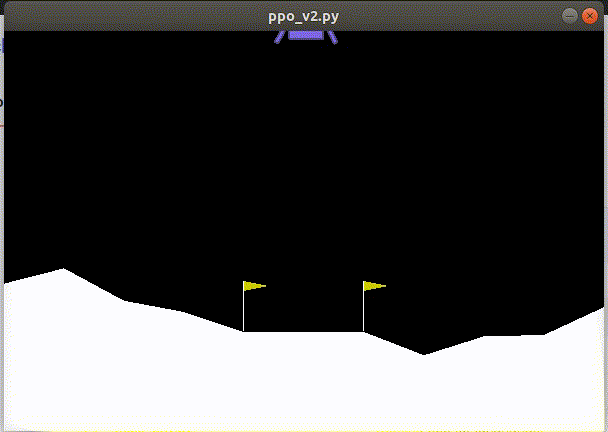

# PPO

Simple PPO implementation, heavily inspired from [stable-baselines3](https://github.com/DLR-RM/stable-baselines3).

Some of the code was also adapted from [DRLND\_Core](https://github.com/yycho0108/DRLND_core), which is one of my past projects on setting up an RL framework.
(Unfortunately, the legacy code was much too overfitted on certain architectures (DQN, discrete actions, etc.), so I sort of had to start over.)

## Running the code

Training:

```
python3 ppo_v2.py --train 1 --max_steps '1000000'
```

Evaluation:

```
python3 ppo_v2.py --train 0 --model_path '/tmp/model.zip'
```

## Sample output


